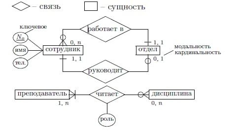

# БД Экз

## 1. База данных как компонент информационной системы. Определение понятия данные, функции ИС. Абстрагирование данных от методов их обработки. Многозвенная архитектура ИС

**Информационная система** - совокупность аппаратных и программных компонентов, связанных с обработкой информации (ПО + данные + люди + железо)

**Данные** - это поддающиеся многократной интерпретации представления информации в **формализованном** виде, пригодные для передачи, интерпретации и обработки

(с) ISO стандарт

**Функции ИС**

1. Сбор
2. Хранение
3. Обработка
4. Представление
5. Прередача

> Данные **абстрагируются** от бизнес-логики, в связи с этим возникают проблемы с доступом к данным

Если есть много приложений, которые хотят обратиться к данным, доступ будет выдан единовременно только одному приложению - иначе возникает риск тупиков.

> Над данными надстраивается слой, который нам обеспечивает доступ к данным - СУБД

Получаем следующую структуру: Клиент - БизнесЛогика - Доступ к данным (Данные)

**Система управления базами данных (СУБД)** — совокупность программных и лингвистических средств общего или специального назначения, обеспечивающих управление созданием и использованием баз данных

**Многозвенная архитектура** - это архитектура, подразумевающая разделение компонентов на функциональные группы

Порядок выполнения запроса в многозвенной архитектуре будет следующим: `Запрос -> СУБД -> БД`

<br>

## 2. Определения базы данных и СУБД по Конноли, Дейту и Хомоненко. Их сходства и различия

### Определения базы данных

**База данных** - это совместно используемый набор логически связанных данных, и описание этих данных, предназначенные для удовлетворения информационных потребностей организаций. **(с) Коннолли и Бегг**

**База данных** - это набор постоянно хранимых данных, используемых прикладными системами какого-либо предприятия. **(с) Дейт**

**База данных** - это совокупность специальным образом организованных данных, хранимых в памяти вычислительной системы, и отображающих состояния объектов и их взаимосвязей в рассматриваемой предметной области. **(с) Хомоненко**

### Определения СУБД

**СУБД** - программное обеспечение, с помощью которго пользователи могут опеределять, создавать и поддерживать базу данных, а также осуществлять к ней контролируемый доступ **(с) Коннолли и Бегг**

**СУБД** - Программное обеспечение, которое управляет всем доступом к базе данных **(с) Дейт**

**СУБД** - это комплекс языковых и программных средств, предназначенный для создания, ведения и совместного использования базы данных многими пользователями  **(с) Хомоненко**

### Различия в определениях

1. **БД**: Конноли и Дейт рассматривают применение базы данных в контексте организации, в то время как Хомоненко даёт более общее определение

2. **СУБД**: во всех определениях СУБД осуществляет контроль доступа к БД

<br>

## 3. Файловые хранилища. Недостатки. Упорядоченные и неупорядоченные файлы

### Файловые хранилиза. Недостатки

Развитие ПО идёт по пути абстрагирования данных от их обработки. Появляется вопрос — **где хранить данные?**

#### 1. В файле

- Проблема разделения доступа к данным и сохранения целостности

#### 2. В нескольких файлах

- **Дедлок**. Образование бесконечной блокировки (для одного файла блокировка конечная)
  - Чтобы это избежать, в БД существуют транзакции

- **Дублирование данных**.
  - Один из путей избавления — нормализация данных

- **Зависимость от типа**.
  - Например, долгий переход от ext3 к ext4 (из-за максимального размера файла 2 Тб в ext3)

- **Формат файла**.
  - Различные (в т.ч. новые) разработчики должны соблюдать формат файла

### Упорядоченные и неупорядоченные файлы

1. **Неупорядоченный** — новый факт в конец файла.
    - Быстрая запись, медленное чтение

2. **Упорядоченный** — сортировка по атрибуту.
    - Не очень-то быстрое чтение и запись

<br>

## 4. Трехуровневая архитектура ANSI/SPARC

Стандарт **ANSI/SPARC** - подход построения архитектуры.
В ней выделяется три слоя архитектуры.

### Уровни архитектуры ANSI/SPARC

1. Внешний у-нь
2. Концептуальный у-нь
3. Внутренний у-нь

### Внешний у-нь

Представление БД с позиции конечного пользователя _(смотрит на человека)_.

1. Определяется обьем и форма представления данных для принятия решения.
2. _Это не про хранение данных_, это про то как принимать эффективные решения на основе данных.

### Концептуальный у-нь

Обобщающее представление БД (то как данные хранятся и какая между ними связь/_смотрит на железо_).

1. Решение о том, какие данные и как они должны хранится _(например, статус будет храниться в числах или в строках)_.
2. Какие ограничения на эти данные накладываются _(проверка регулярными выражениями)_.

### Внутренний у-нь

Физическое представление БД с точки зрения конкретного инструмента.

1. Распределение данных по дисковому пространству
2. Структуры хранения данных
3. Как реализуется безопастность хранения данных (шифрование)
4. Сжатие данных, оптимизация памяти

> Таблица == отношения (relations)

**ANSI/SPARC** подразумевает учет всех трех уровней при приоектировании

**ANSI/SPARC** -> Уровни моделей данных

<br>

## 5. Модель сущность-связь. Классификация сущностей, атрибутов и связей. Нотация Чена для представления модели сущность-связь

> ER(A) - _сущность-отношение-атрибуты_

**Сущность** - _множество экземпляров: реальных или абстрактных однотипных предметов предметной области_

**Сильная сущность** - _может существовать независимо от остальных_

**Слабая сущность** - _может существовать только вместе с другой (сильной)_

У **сущности** могут быть **атрибуты** (свойства сущности)

**Атрибуты**:

1. Простые - номер
2. Составные - адресс, населенный пункт и тд
3. Обязательные атрибуты - однозначно индетифицировать сущность
4. Необязательные атрибуты
5. Однозначные
6. Многозначные

**Типы связей**:

1. Один к одному
2. Один ко многим
3. Многие со многим

> Нотация Чена - это правила обозначения сущностей, атрибутов связей и тд в виде диаграм.

### Нотация Чена

1. Сущности изображаются прямоугольником
    - Прямоугольник, соответствующий слабой сущности, обводится двойной рамкой

2. Атрибуты изображаются в виде овала, соединенного с соответствующим прямоугольником
    - Ключевые атрибуты выделяются подчеркиванием или служебным символом в начале имени

3. Связь обозначается ромбом
    - Ромб окружен двойной линией, если связь задана между слабой сущностью и сущностью, от которой она зависит



<br>

## 6. Логическая и физическая модели данных. Содержание уровней

### Логическая (даталогическая) модель

Определяет **способ** организации данных (концепцию), а **не конкретную реализацию**.

Набор схем отношений, обычно с указанием первичных ключей, а также связей между отношениями, представляющих собой внешние ключи. Учитывается специфика конкретной модели данных, но не учитываться специфика конкретной СУБД.

1. Иерархическая
2. Сетевая
3. Реляционная
4. ... еще какие-то Маятин не сказал

### Физическая модель

Сопоставима с внутренним уровнем (построение часто автоматизировано).

Создание схемы базы данных для конкретной СУБД: Выбор решений, связанных с физической средой хранения данных (выбор методов управления дисковой памятью, разделение БД по файлам и устройствам, методов доступа к данным), создание индексов.

1. Определяем всевозможные ограничения в названиях и т.п
2. Ограничения на типы данных (доменты атрибутов)
3. Индексы и всё такое
4. Разделение на отдельные файлы, партиции

<br>

## 7. Иерархическая и сетевая модели данных: составы моделей, преимущества и недостатки

### Иерархическая модель

> Существует только 2 типа связи: `A Kind Of` / `A Part Of`

#### Компоненты иерархической модели

1. **Поле данных (аттрибут)** - минимальная неделимая, уникально адресуемая единица хранения данных

2. **Сегмент данных (запись/record/экземпляр данных)** - совокупность полей данных, имеющая уникальную идентификацию (сущность в модели ER).

3. Экземпляр сегмента — конкретные значения полей

4. Дерево — совокупность сегментов, связанных с помощью связи родитель-потомок


**Плюсы:**

1. Более эффективное использование памяти, **относительно** простого хранения данных без какой-либо структуры

2. Более быстрое время выполнения CRUD операций, **относительно** простого хранения данных без какой-либо структуры

**Проблемы:**

1. Требуется много памяти для хранения _(производительность)_
2. Сложно контролировать целостность данных
3. Дублирование данных
4. Скорость операций записи
5. Огромные трудности при реорганизации структуры (иерархии)
6. Невозможна связь `Many-to-many`

### Сетевая модель

- Можно ссылаться много раз на один и тот же объект
- Разделяем хранение связей от хранения данных

**Агрегаты** — так называют сегменты


**Плюсы:**

1. Обеспечивает атрибутивную целостность

**Проблемы:**

1. Храним сущности и связи отдельно
2. Появилась проблема ссылочной целостности

<br>

## 8. Реляционная и постреляционная модели данных: составы моделей, преимущества и недостатки

### Реляционная модель

Реляционная — relationship (таблица — отношение)


#### Компоненты реляционной модели

1. **Поле данных** - неделимая, уникально адресуемая единица хранения данных

2. **Отношение** - совокупность множества полей данных

3. **Связь** - хранение с помощью ключа, хранение связи = пара ключей + вес

**Один ко многим** : добавляем ID на продукт (другую сущность)

**Многие ко многим:** отдельная сущность с ID_1, ID_2, другое поле

#### Нововведения

1. Связи хранятся в отдельных отношениях _(таблицах)_
2. Фактически от сетевой модели к реляционной мы переходим, реорганизовав хранение связей _(но не только)_

3. Возникают предпосылки для избежания дублирования данных
4. Позволяет гарантировать целостность данных (при грамотной организации)

5. Позволяет гарантировать избежание дублирвоания данных (при грамотной организации)

6. Позволяет гарантировать эффективное времы выполнения операций записи (при грамотной организации)

> **Сама таблица - тоже связь**

**Плюсы:**

1. Более эффективное использование памяти, **относительно** сетевоой и иерархической моделей

2. Более быстрое время выполнения CRUD операций, **относительно** сетевоой и иерархической моделей

**Проблемы:**

1. **Поле** - неделимый элемент данных, поэтому возникает проблема с определением типа данных и их хранением

### Постреляционная модель

> Фактически это реляционная модель, но без целостности данных - поле данных может само по себе являться агрегатом (снимаем требование неделимости с отдельного поля)

Поле данных - _агрегат_

**Плюсы:**

1. Представление данных становится наглядным и нет необходимости соединять таблицы.

**Проблемы:**

1. При нормализации отношенией не гарантируется получение целостных данных, так как мы выносим данные из понятия отношений

2. Целостность данных ложится на плечи разработчиков

3. При большом количестве данных все алгоритмы в основном работают за `O(e)`

> Появилась идея о том, что скорость вычисления намного чажнее, чем память.

<br>

## 9. Многомерная и объектно-ориентированная модели данных: составы моделей, преимущества и недостатки

### Многомерная модель

#### Нововведения

Данные организованы не в виде множества связанных двумерных таблиц, а в виде упорядоченных многомерных массивов.

**Срез** — подмножество гиперкуба, полученное путём фиксации одного или нескольких измерений.

1. Позволяет быстро искать данные
2. Ускоряет работу с СУБД (хранит таблицы фактически с кешем)

**Плюсы:**

1. Поиск и извлечение данных производятся гораздо быстрее за счёт того, что многомерная БД денормализована и содержит заранее вычесленные агрегаты.
2. Более простая процедура встраивания функций в многомерную БД
3. Стоимость поддержки ниже, чем у реляционной

**Проблемы:**

1. Неэффективно по памяти
2. Отсутствие значения приведёт к пустой “линии” в “кубе” данных **(olap кубы)**
3. **Olap кубы** очень сложно изменять с точки зрения структуры _(добавляется измерение)_

4. Актуальность кеша

> Сама таблица - связь, все записи - продукты, их объединяет множественное отношение.

### Объектно-ориентированная модель

Иерархическая структура, узлами которой являются объекты.

Между записями устанавливаются связи, подобные связям в ООП. Свойства объектов описываются либо одним из стандартных типов или собственным классом.

#### Нововведения

1. Можем хранить объекты целиком, не разбрасывая его на разные таблицы
2. Улучшается производительность в ООП приложениях
3. Удобно с точки хрения распределённых систем

**Плюсы:**

1. Не нужно знать о взаимодействии объектов, просто обращаемся к конкретному.
2. Возможность идентифицировать отдельные записи в базе

**Проблемы:**

1. Зацикливаемся на ООП парадигме
2. Вопрос целостности данных ложится на код
3. Низкая скорость выполнения запрсосов

<br>

## 10. Реляционная модель данных: терминология, свойства отношения

> Основой реляционной базы данных является понятие отношения.

### Терминология

> Отношение - плоская таблица.

**Схема отношения** - первая строка таблицы (заголовок столбцов)

**Кортеж** - это отдельная строка в таблице

**Аттрибут** - это отдельный столбец в таблице

**Поле данных** - пересечение кортежей и аттрибутов

**Домен** - множество допустимых значений аттрибута

**Степень отношения** - количество аттрибутов _(столбцов)_

**Координльность соотношения** - количество кортежей _(строк)_

### Свойства отошения

1. Уникальность имени отношения в реляционной схеме _(каждая таблица имееет уникальное имя)_
2. Каждая ячейка содержит только одно неделимое значение
3. Уникальность имени аттрибута в пределах отношения
4. Значение любого аттрибута берутся из одного и того же домена
5. Каждый кортеж уникален
6. Порядок следования аттрибутов и порядок следования кортежей не имеют значения (депрекейтед из-за производительности)

> В реляционной модели хранятся только отношения _(без связей)_, все объекты однотипны

<br>

## 11. Реляционная модель данных: виды ключей, реализация различных типов связей, виды целостности

### Виды ключей

**Суперключ** - это аттрибут или множество аттрибутов, единственным образом идентифицирующие кортеж.

> _Всё множество аттрибутов само по себе является **суперключом**._

**Потенциальный ключ** - это суперключ, который не содержит модмножество, также являющегося суперключом _(суперключ минимального размера)_.

> _Потенциальный ключ может быть **простым** и **составным**._

**Первичный ключ (Primary Key)** - это один из потенциальных ключей, который выбран для уникальной идентификации кортежей данного отношения.

**Внешний ключ (Foreign Key)** - это аттрибут или множество аттрибутов, которое соответствует потенциальному ключу некоторого, может быть, того же самого отношения.

### Типы связей

#### 1. Один-к-одному

Первичный ключ одного из отношений является одновременно и внешним ключём.

> Есть таблица работников, и таблица менеджеров по продажам. Id работника будет `PK`, который взят из `PK` менеджера. Таким образом, Id менеджера - это `PK` и `FK` одновременно.

**Employee**

| Id_Emp (`PK`) | Id_Boss (`FK`) | Other fields |
| :-----------: |:--------------:| :-----------:|
|       2       |        1       |     field    |

**SalesPerson**

| Id_SalesPerson (`PK`, `FK`) | Other fields |
| :-------------------------: | :-----------:|
|           1, 2              |     field    |

#### 2. Один-к-многим

> Есть таблица групп и студентов. Значение Id группы у студента будет `FK`, который взят из Id, то есть `PK` группы.

**Student**

| Table_Number | LastName | MiddleName | FirstName | Group_Id (`FK`) |
| :----------: |:--------:| :---------:| :-------: | :-------------: |
|       1      |  Кудашев | Эдуардович |  Искандер |       32011     |

**Group**

| Group_Id (`PK`) |  Other fields |
| :-------------: | :-----------: |
|      32011      |      field    |

#### 3. Много-ко-многим

Обычно используются таблицы-связки, хранящие связи по Id.

> Есть менеджеры, каждый из которых продаёт продукты. Создаём таблицу с `PK` продукта и менеджера.

### Виды целостности

1. Сущностная целостность - в отношении ни один аттрибут `PK` не может содержать `NULL` значение
2. Ссылочная целостность - если в отношении существует `FK`, то значение этого ключа должно соответствовать существующему значению `PK` в другом отношении

<br>

## 12. Операции реляционной алгебры: проекция, выборка, объединение, разность, пересечение

### Унарные

#### 1. Проекция - `П_{a_1, a_2, a_3, ..., a_n}(R)`

**Проекция** (`SELECT`) - это операция, которая определяет новое отношение, содержащее вертикальном подмножество исходного отношения, создоваемое посредством извлечения значений указанных аттрибутов и исключения из резуьтата строк-дубликатов.

#### 2. Выборка - `S_{предикат}(R)`

**Выборка** (`WHERE`) - это операция, которая определяет результирующее отношение, которое содержит только те кортежи из исходного отношения, которые удовлетворяют заданному условию _(предикату)_.

### Бинарные

#### 3. Объединение - `R u S`

**Объединение** (`UNION`) - это операция над отношениями R и S, определяющая **новое** отношение, которое включает все кортежи, содержащиеся только в R, все кортежи, содержащиеся только в S и кортежи, содержащиеся одновременно в R и S с исключением дубликатов.

> Объединение возможно только, если отношения совместимы, и обычно объединение считается **опасной операцией**

**Совместимость по объединению** - два отошения R и S будут совместимы по объединению, когда они состоят из одинакового кол-ва аттрибутов, и каждая пара соответствующих аттрибутов будет иметь одинаковый домен.

#### 4. Разность - `R - S`

**Разность** - это отношение, состоящее из кортежей, которые есть в отношении R, но отсутствуют в отношении S

> Данная операция требует, чтобы отношения были совместимы по объекдинению

#### 5. Пересечение - `R ^ S`

**Пересечение** - это отношение, которое определяет кортежи, присутствующие в обоих отношениях одновременно

<br>

## 13. Операции реляционной алгебры: Тета-соединение, эквисоединение, естественное соединение, левое внешнее соединение, полусоединение

### Небинарные

#### 1. Декартово произведение - `R x S`

**Декартово произведение** - определяет новое отношение, которое является результатом конкатенаци каждого кортежа из отношения R с каждым кортежем из отношения S.

#### 2. Тета-соединение - `R _f S`, где `f = R * a_i (Theta) S * b_i, (Theta) = { <, <=, =, >, >= }`

**Тета-соединение** (`R _f S`) - определяет новое отношение, которое содержит кортежи из декартова произведения отношений R и S, удовлетворяющие предикату f

___

> Дополнительные операции, не реализованные в `SQL`

#### 3. Экви-соединение

**Экви-соединение** - это тета-соединение, где (theta) - это операция равно

#### 4. Естественное соединение - `R _ S`

**Естественное соединение** - это соединение по эквивалентности двух отношений, выполненное по всем общим аттрибутам, из результатов которого исключается по одному экземпляру каждого общего аттрибута.

#### 5. Левое внешнее соединение - ``

**Левое внешнее соединение** - это тета-соединение, при котором в результирующее отношение включаются также кортежи отношения R, не имеющие совпадающих значений в общих столбцах отношения S.

#### 6. Полу-соединение

**Полу-соединение** - определяет отношение, содержащее только те кортежи из R, которые входят в соединение R и S

<br>

## 14. Структура и порядок выполнения предложения Select в SQL

### Как выглядит SELECT

```sql
SELECT [DISTINCT | ALL] { * | [ColumsExpression [AS NewName], ... ] }
FROM TableName [AS NewName]
    [ { INNER | LEFTOUTER | FULL } JOIN ] TasbeName2 [AS NewName]
    ON condition ]
[ WHERE condition ]
[ GROUP BY ColumnList ]
[ HAVING condition ]
[ ORDER BY ColumnList [ ASC | DESC ]]
```

### Последовательность выполнения SELECT

1. `FROM`
2. `JOIN ... ON`
3. `WHERE`
4. `GROUP BY`
5. `HAVING`
6. `SELECT`
7. `DISTINCT`
8. `ORDER BY`

<br>

## 15. Алгоритмы реализации соединений отношений в SQL

Для того, чтобы обеспечить целостность, мы будем заниматься денормализацией _(создавать множество связанных таблиц)_.

Это приводит к снижению **производительности**.

> Соединение таблиц - это дорого!

### 1. Неэффективно (декартово произведение)

> Вложенный цикл

```csharp
for (int i = 0; i < R.Count; ++i)
{
    for (int j = 0; j < S.Count; ++j)
    {
        if (R[i].atr != S[j].atr) continue;
        Console.WriteLine(r + s);
    }
}
```

```py
for r in R
    for s in S
        if (r.atr == s.atr)
            print(r + s)
```

### 2. Эффективно

> Предварительная сортировка

```py
R.sort(atr)
S.sort(atr)

while not EndOF(S) ans not EndOF(R)
    if (r.atr < s.atr)
        next(R)
    if (r.atr = s.atr)
        print(r + s)
        next(R)
    if (r.atr > s.atr)
        next(S)
```

<br>

## 16. Нормализация реляционной модели: избыточность, аномалии, суть метода нормальных форм. Виды зависимостей между атрибутами

**Нормализация** - преобразование отношения к виду, отвечающему нормальной форме.

> **Нормальная форма** - некоторая характеристика отношения.

У нормальных форм есь иерархия: каждая следующая является предыдущей.

## Избыточность

**Студент**

|     Фио     | Группа | Образовательная программа |
| :---------: |:------:| :------------------------:|
| Либченко М. | M32011 |      Программирование     |

> Образовательная программа хранится либо у одного студента, либо у всех сразу. В обоих случаях это приводит к своим издержкам.

## Аномалия

### 1. Модификации

**Аномалия модификации** - изменение значения одной записи привлечёт за собой просмотр всей таблицы и изменения некоторых других записей.

### 2. Удаления

**Аномалия удаления** - при удалении записи может пропасть и другая информация.

### 3. Добавления

**Аномалия добавления** - информацию в таблицу нельзя поместить, пока она неполная или требуется дополнительный просмотр табиц.

> Аномалии потенциально приводят нас к нарушению целостности данных.

## Решение проблемы аномалии

**Расширенная таблица студентов**

|  Фио `(PK)` | Группа `(PK)` | Образовательная программа |  Факультет  | Форма обучения |
| :---------: |:-------------:| :-----------------------: |:-----------:| :------------: |
| Либченко М. |     M32011    |      Программирование     |     ФИТиП   |      Очная     |

### Функциональная зависимость между аттрибутами

**Функциональная зависимость между аттрибутами** `(X -> Y)` - в отношении R атрибут y функцинально зависит от атрибута x тогда и только тогда, когда каждому значению x соответствует в точности одно значение y.

> Факультет функционально зависит от образовательной программы.

### Частичная функциональная зависимость

**Частичная функциональная зависимость** `(ФИО + Группа) -> Образовательная программа` - зависимость неключевого атрибута от часть составного ключа.

### Полная функциональная зависимость

**Полная функциональная зависимость** `(ФИО + Группа) -> Форма обучения` - неключевой атрибут зависит от всего составного ключа.

### Транзитивная функциональная зависимость

**Транзитивная функциональная зависимость** `(X -> Z, Y: X -> Y && Y -> Z)` - существует такое множество атрибутов Y, что выполняется требование о существовании зависимостей `X -> Y && Y -> Z)`

<br>

## 17. Первая и вторая нормальные формы. Примеры

### Первая нормальная форма

Отношение находится в первой нормальной форме, если все его атрибуты явзяются простыми.

> ФИО мешает нашей таблице соответствовать первой нормальной форме. Для того, чтобы таблица студента находилась в ПНФ, необходимо разделить столбец ФИО на 3 столбца: Ф, И, О

### Вторая нормальная форма

Отношение находится во второй нормальной форме, если оно находится в первой нормальной форме, и каждый неключевой атрибут **функционально полно** зависит от первичного ключа.

|  Ф  |  И  |  О  |  Группа  | Форма обучения |
| :-: | :-: | :-: | :------: | :------------: |
|  Л. |  М. |  В. |  M32011  |      Очная     |

| Группа | Образовательная программа |  Факультет  |
| :----: | :-----------------------: | :---------: |
| M32011 |      Программирование     |    ФИТиП    |

<br>

## 18. Третья нормальная форма. Примеры

### Третья нормальная форма

1. Отношение находится в третьей нормальной форме, если оно находится во второй нормальной форме, и все неключевые атрибуты взаимно независимы и полностью зависят от первичного ключа.

2. Отношение находится в третьей нормальной форме, если оно находится во второй нормальной форме, и ни один ключевой атрибут не находится в транзитивной функциональной зависимости от потенциального ключа.

|  Ф  |  И  |  О  |  Группа  | Форма обучения |
| :-: | :-: | :-: | :------: | :------------: |
|  К. |  И. |  Э. |  M32011  |      Очная     |

| Группа | Образовательная программа |
| :----: | :-----------------------: |
| M32011 |      Программирование     |

| Образовательная программа | Факультет |
| :-----------------------: | :-------: |
|      Программирование     |   ФИТиП   |

<br>

## 19. Нормальная форма Бойса-Кодда. Примеры

### Нормальная форма Бойса-Кодда

**Проекты**

|  Номер студента  |     ФИО    |  Номер проекта  |  Роль  |
| :--------------: | :--------: | :-------------: | :----: |
|       307484     | Кудашев И. |         1       | Бекенд |

> Данное отношение не соответствует НФ Бойса-Кодда

Отношение находится в нормальной форме Бойса-Кодда, если детерминанты _(зависимые части)_ всех зависимостей являются потенциальными ключами.

#### Приведение к нормальной форме Бойса-Кодда

| Студент | Номер студента |    ФИО    |
| :-----: | :------------: | :-------: |
| Кудашев |      307484    |  К. И. Э. |

|  Номер студента  |  Номер проекта  |  Роль  |
| :--------------: | :-------------: | :----: |
|       307484     |         1       | Бекенд |

<br>

## 20. Четвертая нормальная форма. Примеры

### Четвёртая нормальная форма

Отношение находится в четвёртой нормальной форме, если оно находится в нормальной форме Бойса-Кодда, и не содержит многозначных зависимостей.

|  Дисциплина |    Лектор    |    Практик   |
| :---------: | :----------: | :----------: |
| Базы данных | Маятин А. В. | Маятин А. В. |

> Не соответствует четвёртой нормальной форме, но соответствует всем предыдущим

#### Приведение к четвёртой нормальной форме**

**Лекторы**

|  Дисциплина |     Лектор   |
| :---------: | :----------: |
| Базы данных | Маятин А. В. |

**Практики**

|  Дисциплина |    Практик    |
| :---------: | :-----------: |
| Базы данных |  Маятин А. В. |

> Вопрос приведения к четвёртой нормальной форме - вопрос **интерпритации** данных.

<br>

## 21. Использование индексов для повышения производительности. Виды индексов

<br>

## 22. Использование представлений для повышений производительности и безопасности. Виды представлений. Преимущества и недостатки представлений

<br>

## 23. Транзакции. Понятие транзакции. Свойства транзакции

<br>

## 24. Проблемы конкурирующих транзакций и методы их решения. Уровни изоляции транзакций

<br>

## 25. Иерархия уровней безопасности по оранжевой книге. Понятия идентификации и аутентификации

<br>

## 26. Избирательный (дискреционный) контроль доступа. Ролевой контроль доступа

<br>

## 27. Мандатный контроль доступа

<br>

## 28. Аудит и шифрование данных в БД

<br>

## 29. Распределенные БД. Определение. Стратегии размещения данных в системе, их достоинства и недостатки. Понятие прозрачности

<br>

## 30. Двенадцать правил Дейта распределенных БД

<br>

## 31. Предпосылки к появлению NoSQL баз данных

<br>

## 32. Общие характеристики NoSQL баз данных

<br>

## 33. CAP теорема. Пример

<br>

## 34. NoSQL решения: хранилища ключ-значение и документоориентированные БД

<br>

## 35. NoSQL решения: колоночные и графовые БД

<br>

## 36. База знаний. Определение, отличие от базы данных, замкнутые и открытые БЗ

<br>

## 37. Логическая модель представления знаний

<br>

## 38. Сетевая модель представления знаний, семантическая сеть, онтология

<br>

## 39. Фреймовая модель представления знаний

<br>

## 40. Продукционная модель представления знаний
